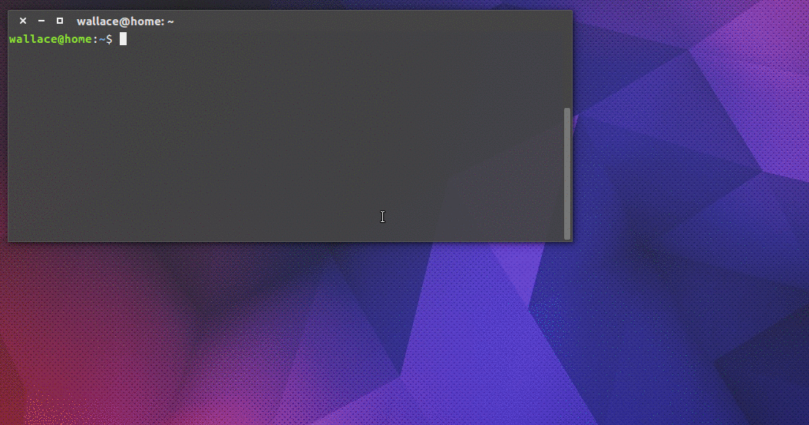

# Moov

> CLI



O player padrão definido é o [VLC Player][2], então você vai precisar dele pra assistir os vídeos.

## Instalação

Você pode instalar globalmente usando o npm:

```
$ npm i -g moov
```

Ou clonar esse repositório:

```
$ git clone -b cli git@github.com:Webschool-io/Project-Moov.git stream
$ cd stream
$ npm link
$ moov
```

## Como usar:

No seu terminal digite:

```
$ moov search <nome-do-filme> [opções]
```

Para ver as opções disponíveis: `moov --help`

## Licença:

[MIT][3]

[1]: https://github.com/mafintosh/peerflix "Peerflix"
[2]: http://www.videolan.org/vlc/ "VLC Player :3"
[3]: https://github.com/Webschool-io/Project-Moov/blob/cli/LICENSE "Licença"
